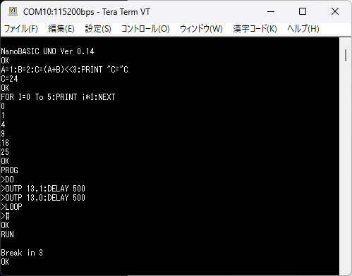

# NanoBASIC UNO (English)
*A minimal BASIC interpreter for Arduino UNO (ATmega328P)*


## 💾 About

**NanoBASIC UNO** is a minimal BASIC interpreter developed by shachi-lab for
**8-bit AVR microcontrollers (Arduino UNO / ATmega328P)**.

It is a modern reconstruction of the original BASIC interpreter written in 2012 for the STM8S platform, redesigned with a clean architecture and reimplemented for today's MCU environments.

The goal of this project is to provide **a compact, practical BASIC environment for small microcontrollers**, using only minimal memory.

日本語版READMEはこちら → [README_jp.md](README_jp.md)

  
Example run of nanoBASIC UNO. After the startup banner (Ver 0.14),  
it demonstrates multiple statements on one line, a FOR/NEXT loop,  
and a simple LED blink routine using Arduino UNO’s built-in D13 pin.  
The Ctrl-C break behavior is also shown.

---

## ✨ Features

* **Minimal BASIC interpreter architecture**
  * Line numbers behave as labels
  * Intermediate bytecode virtual machine
  * Recursive-descent expression parser
* **Runs on Arduino UNO (ATmega328P)**
* **REPL Mode / Run Mode suported**
* **GPIO / ADC / PWM / TICK / INKEY supported**
* Includes classic BASIC features such as
  **DATA / READ / RESTORE**
* Supports modern operators such as
  **+= / -= / <<= / >>= / && / ||**
* **SAVE / LOAD** to store and load programs,  
  with support for **AutoRun**
* Hardware-dependent components are isolated in a
  **BIOS layer (bios_uno.cpp)**
* Clean, portable header structure
* MIT License

---

## 🚀 Quick Start Guide

Start here if you want to run nanoBASIC UNO immediately.

- **Quick Start (English)**  
  → [docs/QuickStart_en.md](docs/QuickStart_en.md)

- **クイックスタートガイド（日本語版）**  
  → [docs/QuickStart_jp.md](docs/QuickStart_jp.md)

---

## 📘 Documentation
- **Reference Manual (EN)**  
  → [docs/nanoBASIC_UNO_Reference_Manual_en.md](docs/nanoBASIC_UNO_Reference_Manual_en.md)

- **リファレンスマニュアル（日本語版）**  
  → [docs/nanoBASIC_UNO_Reference_Manual_ja.md](docs/nanoBASIC_UNO_Reference_Manual_ja.md)

---

## 📦 Repository Structure

```
/ (project root)
├── docs
|    ├── QuickStart_en.md
|    ├── QuickStart_jp.md
|    ├── nanoBASIC_UNO_Reference_Manual_en.md
|    └── nanoBASIC_UNO_Reference_Manual_ja.md
├── examples
|    └── ...
├── src
|    ├── nano_basic_defs.h      # Language specification (platform-independent)
|    ├── nano_basic_uno_conf.h  # UNO-specific configuration & version info
|    ├── nano_basic_uno.h       # Minimal Arduino API (basicInit / basicMain)
|    ├── nano_basic_uno.cpp     # Interpreter core
|    ├── bios_uno.cpp           # Arduino UNO hardware layer
|    └── bios_uno.h             # hardware layer API
├── nanoBASIC_UNO.ino           # Arduino entry point
├── README.md
├── README_jp.md
└── LICENSE.md
```

---

## 🧠 Architecture Overview

### Interpreter Core

* `convertInternalCode()`
  Converts BASIC source lines into tokenized internal code

* `interpreterMain()`
  Internal bytecode execution loop

* `expr()` and related functions
  Recursive-descent expression evaluation

### BIOS Layer

All UNO-dependent hardware access is isolated in **bios_uno.cpp**:

* Digital I/O
* ADC
* PWM
* Random number generation
* System tick
* Serial I/O

For porting to other MCUs, replacing **bios_uno.cpp / bios_uno.h** is sufficient.

---

## ⚙️ Platform Notes: AVR-Specific Implementation (Arduino UNO)

To optimize for the ATmega328P architecture,
some string-handling logic uses **AVR-specific PROGMEM access**.

Because AVR uses a Harvard architecture (Flash and RAM are fully separate):

* Strings are stored in **PROGMEM**
* Access performed via `pgm_read_byte()`
* `F("...")` macro reduces RAM consumption
* Functions such as `printStringFlash()` handle Flash-resident strings

### 📝 Porting to other MCUs

On MCUs where Flash and RAM share a unified address space
(e.g., ESP32 / ARM / RP2040):

* Replace PROGMEM usage with normal RAM strings
* Remove `pgm_read_byte()`
* Abstract string access similar to the BIOS layer

Except for AVR-specific string storage,
the NanoBASIC core is largely platform-independent.

---

## 🚀 Getting Started

### 1. Open the project in Arduino IDE

Open `nanoBASIC_UNO.ino`.

### 2. Compile & Upload

Select **Arduino UNO** and upload.

### 3. Serial Monitor
Configure the serial monitor as follows:
* 115200 baud  
* CR+LF

Startup message:

```
NanoBASIC UNO Ver 0.15
OK
```

---

## 💡 REPL vs Run Mode

NanoBASIC UNO provides **two execution modes**.

---

### 🔹 1. REPL (Interactive) Mode

Upon startup, each input line is **executed immediately**
and **not saved** to the program area.
```
? 120+3
123
OK
```

Variables and multiple statements are also allowed:

```
A=2:FOR I=1 TO 3:? I*A:NEXT
2
4
6
OK
```

---

### 🔹 2. Run (Program execution) Mode

For storing multiple program lines, enter:

```
PROG
>DO
>OUTP 13,1
>DELAY 500
>OUTP 13,0
>DELAY 500
>LOOP
>#
RUN
```

`#` ends PROG mode.
Entered lines are stored **in RAM** and executed via `RUN`.

*Note: Program memory exists only in RAM and is cleared on reset.*

---

## Interrupting Execution (Ctrl-C)

While a program is running, pressing **Ctrl-C** in the serial terminal  
immediately aborts the execution.  
This behaves the same as issuing `STOP`.

Useful for breaking out of long or accidental infinite loops.

---

## 🔧 Supported Statements

### Case Sensitivity

Command names, statements, and function names are **not case-sensitive**.  
For example, `PRINT`, `print`, and `PrInT` are treated the same.

### Commands
| Statement                  | Meaning                     |
| -------------------------- | --------------------------- |
| PRINT                      | Output                      |
| INPUT                      | Input                       |
| GOTO                       | Jump to line number         |
| GOSUB / RETURN             | Subroutine                  |
| FOR / NEXT                 | Counting loop               |
| DO / LOOP / WHILE          | Conditional loop            |
| CONTINUE / EXIT            | Loop modifiers              |
| IF / ELSEIF / ELSE / ENDIF | Conditional branching       |
| DATA / READ / RESTORE      | Data table handling         |
| OUTP                       | Digital output              |
| PWM                        | PWM output                  |
| DELAY / PAUSE              | Delay                       |
| END / STOP                 | Terminate / break execution |
| RESUME                     | Resume from STOP/BREAK      |
| RESET                      | System control              |
| RUN / NEW                  | Program control             |
| PROG / LIST / SAVE / LOAD  | Program management          |
| RANDOMIZE                  | Initialize random generator |

### Functions
| Function | Meaning        |
| -------- | -------------- |
| ABS      | Absolute value |
| INP      | Digital input  |
| ADC      | Analog input   |
| RND      | Random number  |

### Special Variables
| Valiable | Meaning             |
| -------- | ------------------- |
| TICK     | System time (ms)    |
| INKEY    | Serial input buffer |

### 🔣 Operators
| Operator               | Meaning               |
| ---------------------- | --------------------- |
| +, -, *, /, %          | Arithmetic            |
| -, !, ~                | Unary ops             |
| &, \|, ^               | Bitwise ops           |
| &&, \|\|               | Logical ops           |
| <<, >>                 | Shift ops             |
| =, ==, <>, <=, >=, <   | Comparison            |

### () Parentheses
Parentheses override standard operator precedence.

### Numbers
NanoBASIC uses **16-bit signed integers** (-32768 to 32767).  
No floating-point support.  
Overflow is not checked.  
* Default: decimal
* `$xxxx`: hexadecimal
```
A=10
B=$BEEF
```

### Variables
* General variables: **A–Z** (single-letter)
* Array variable: **@[0]–@[63]**
```
Z=10
@[1]=0
```

### Assignment
Assignments use the form:
```
A=(B+10)*5
```

### Compound assignments
Compound assignments are also supported.
+=、 =、 *=、 /=、 %=、 |=、 &=、 ^= 、 <<=、 >>=
```
A<<=2
```

### Increment / Decrement
Appending **"++"** or **"--"** to a variable increments or decrements its value by 1.  
```
A++
```
This increases the value of variable **A** by 1.  
**Note:**  
Increment and decrement operators **cannot be used inside expressions.**  
They may appear **only directly after a variable**.

### Strings
Strings may be used **only inside PRINT (or '?')**.
```
? "Hello!"
Hello!
OK
A=5:? "A="A*2
A=10
OK
```
String variables do not exist.

### Condition Evaluation
In `IF` and `WHILE`, conditions are evaluated as:

* **0 → false**
* **non-zero → true**

Comparison operators are optional;
any numeric expression can act as a condition.

### Comments
A single quote **'** begins a comment that continues to the end of the line.  
It may appear after a statement separator **":"** to create inline comments.  
```
OUTP 13,1 :' LED ON
```

---

## 🤝 Contributing

Issues and Pull Requests are welcome.
Suggestions for improvements or MCU porting are highly encouraged.

---

## 🌐 Future

* nanoBASIC UNO may receive additional features or improvements in future releases.
* We are considering possible ports to other platforms in the future.

---

## 📄 License

MIT License
Copyright (c) 2025 shachi-lab

See **LICENSE.md** for details.

---
